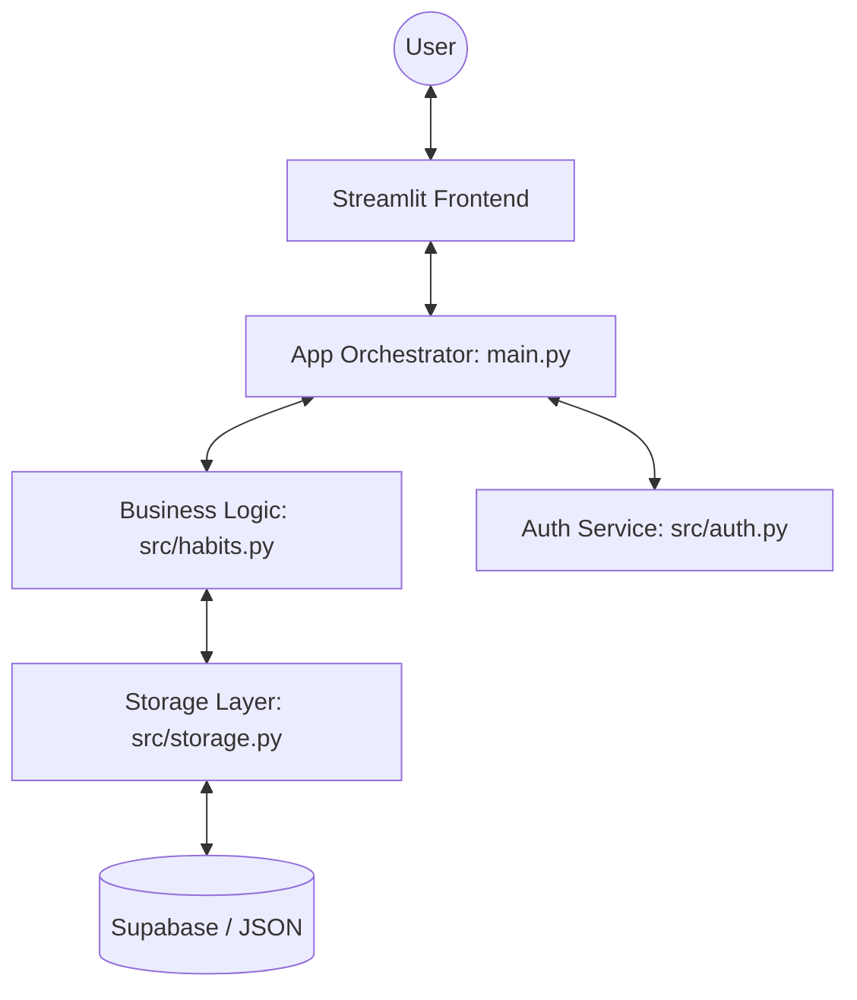

# System Architecture & Development Standards (AGENTS.md) 🤖

This document outlines the technical architecture, design patterns, and engineering standards governing the **Habit.Space** ecosystem. It serves as a North Star for all "agents" (human or automated) contributing to the codebase.

---

## 🏛️ Architectural Blueprint

The system follows a modified **Model-View-Controller (MVC)** pattern optimized for the reactive nature of Streamlit.

### 1. Presentation Layer (`src/ui_components.py`)
- **Atomic Design**: Reusable, stateless components.
- **Themes**: CSS-driven visual modules (Cyberpunk, Retro, Light).
- **Reactive UI**: Immediate feedback loops using Streamlit session state.

### 2. Logic Layer (`src/habits.py`, `src/auth.py`)
- **Domain Modeling**: Data classes for Habits, Users, and Events.
- **Gamification Logic**: Mathematical algorithms for XP calculation and trait blending.
- **Stateless Analysis**: Pure functions for calculating streaks and completion rates.

### 3. Data Layer (`src/storage.py`)
- **Resilient Persistence**: Graceful fallback between Supabase (Cloud) and Local JSON.
- **Schema Resilience**: Automated column-stripping for mismatched database schemas.

---

## 📜 Engineering Standards

### **Clean Code Principles**
- **Single Responsibility**: Each module and function handles exactly one task.
- **Type Hinting**: All functions must use Python type hints for clarity and IDE support.
- **Docstrings**: Google-style docstrings are required for all public methods.

### **Coding Style**
- **PEP 8 Compliance**: Strict adherence to the standard Python style guide.
- **Naming Conventions**: 
  - Variables/Functions: `snake_case`
  - Classes: `PascalCase`
  - Constants: `SCREAMING_SNAKE_CASE`

### **Testing Protocol**
- **Unit Tests**: Mandatory for all logic in `src/`.
- **Regression Testing**: `pytest` must pass before any deployment or pull request.
- **Mocking**: Use `pytest-mock` for database and external API calls.

---

## 🛠️ Automated Orchestration (The "Agent" Workflow)

When modifying this codebase, the following workflow is expected:
1. **Research**: Map dependencies and verify current behavior.
2. **Strategy**: Propose architectural changes before implementation.
3. **Implementation**: Surgical updates followed by immediate linting.
4. **Validation**: Run existing tests AND add new ones for the fix/feature.

---

## 🔮 Future Roadmap

- **API Layer**: Transitioning to a FastAPI backend for mobile support.
- **AI Integration**: Predictive analytics for habit fatigue detection.
- **Social Graph**: Peer-to-peer challenge orchestration.

---

**Maintaining the highest standards of software craftsmanship.**
